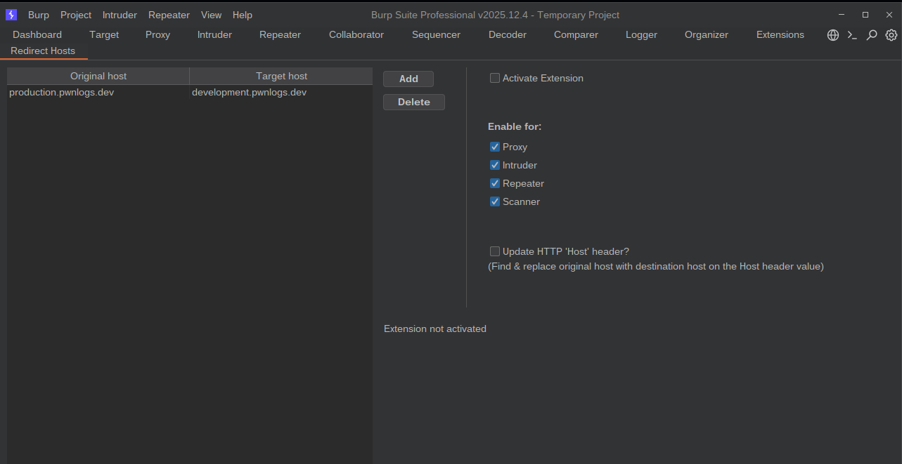

# Host Redirector: Burp Suite Extension

Host Redirector is a lightweight Burp Suite extension designed to seamlessly reroute traffic from one host to another. This is particularly useful for security researchers and developers who need to test production-level configurations against development or staging environments.

## Key Features
* __Target Decoupling:__ Redirect requests to a new destination IP or domain while keeping the original `Host` header.  
This allows you to test backend servers directly without breaking application logic that relies on the hostname.  
This is also ideal for testing WAF bypasses, Virtual Hosting configurations, or Origin-Server direct access. 
  * You can optionally toggle "Update `Host` Header" if the destination requires it.
* __HTTP/1.1 & HTTP/2 Support__
* __Transparent Proxying:__ Works across all Burp tools (Proxy, Repeater, Intruder, etc.).  
You can also choose to enable/disable specific tools.
* __Configurable UI:__ Manage multiple redirection rules through a dedicated tab in the Burp Suite UI.
* __Dynamic Redirection:__ Map any source hostname to a destination hostname.

## How It Works
When a request is captured by Burp Suite, the extension checks the destination host against your configured rules. If a match is found, the extension:
1. Changes the destination IP/domain of the socket.
2. Rewrites the HTTP Host header to match the new destination (if opted).  
This is a _'find \& replace'_ logic on the `Host` header value. Hence, your port number and any other payload you have on the `Host` header stays intact!

## Installation
Simply download the extension, load it on your Burp Suite and enjoy!

## Example Use Case

If you want to test how your production session cookies behave on a QA environment:

1. Add `prod.app.com` as the Source.
2. Add `qa.app.com` as the Destination.
3. Browse `https://prod.app.com` in your Burp-configured browser.
4. Burp will automatically fetch data from `qa.app.com` while your browser still thinks it is communicating with production.

